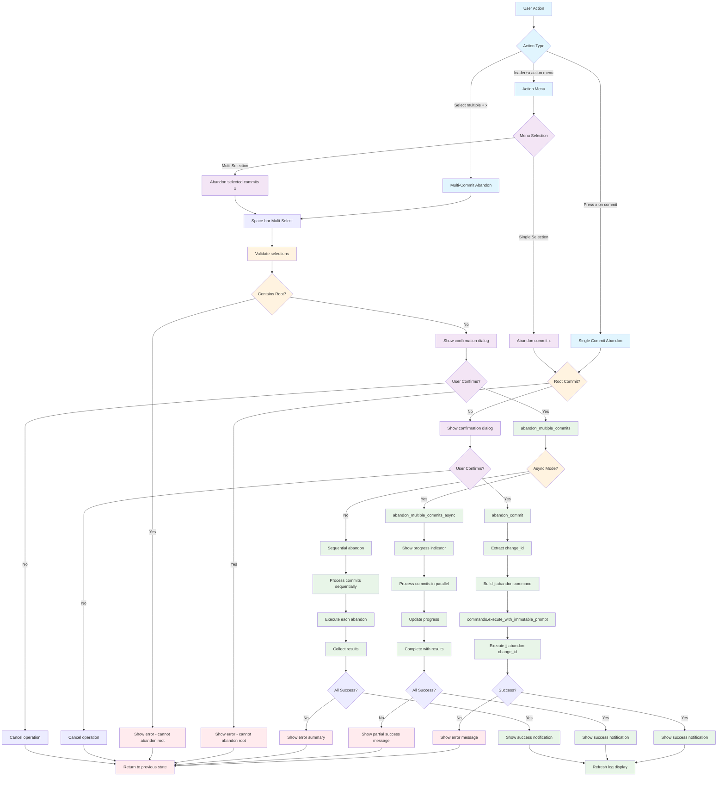

# Abandon Command Workflow

## Key Features

- **Root Commit Protection**: Cannot abandon the root commit
- **Confirmation Dialog**: User must confirm destructive operation
- **Multi-Select Support**: Space-bar selection for multiple commits
- **Async Support**: Progress indicators for multiple abandon operations
- **Error Handling**: Graceful failure with detailed error messages

## File Locations

- **Core**: `lua/jj-nvim/jj/abandon.lua`
- **Actions**: `lua/jj-nvim/jj/actions.lua:502-506`
- **Action Menu**: `lua/jj-nvim/ui/action_menu.lua:119-123, 152-156`
- **Keybinding**: `x` key for abandon operation