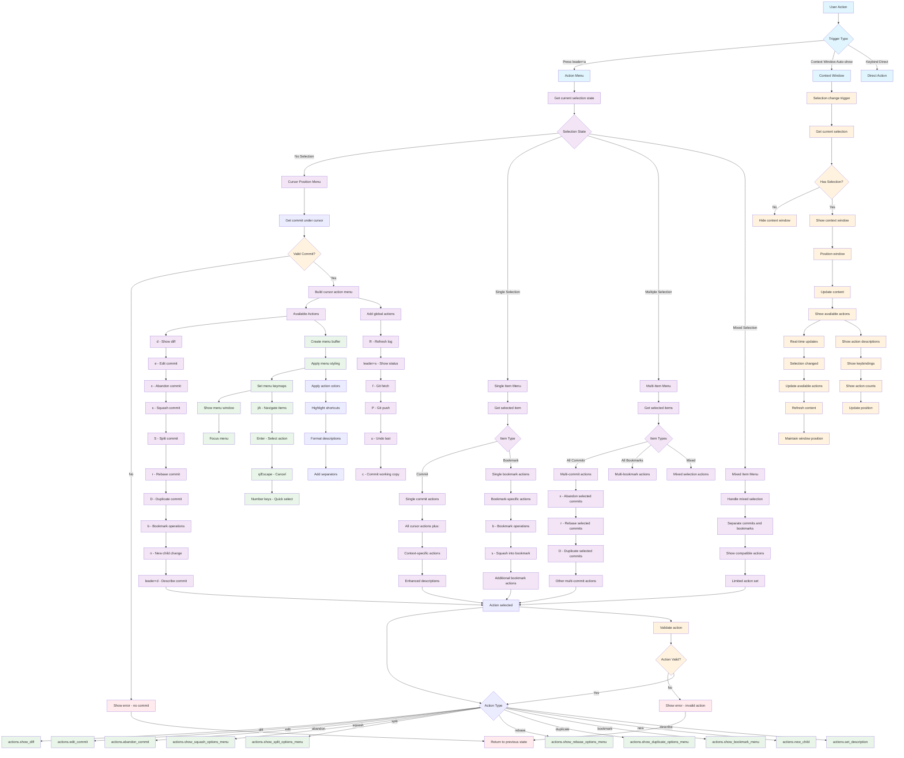

# Action Menu System Workflow

## Key Components

### Action Menu (`<leader>a`)
- **Context-sensitive**: Shows different actions based on selection state
- **Interactive**: Full menu navigation with keybindings
- **Comprehensive**: Access to all available actions

### Context Window (Auto-show)
- **Non-intrusive**: Automatically appears/disappears with selections
- **Real-time**: Updates content as selections change
- **Informative**: Shows available actions without requiring interaction

## Selection States

### No Selection (Cursor Position)
Actions available for commit under cursor:
- **d**: Show diff
- **e**: Edit commit
- **x**: Abandon commit
- **s**: Squash commit
- **S**: Split commit
- **r**: Rebase commit
- **D**: Duplicate commit
- **b**: Bookmark operations
- **n**: New child change
- **<leader>d**: Describe commit

### Single Selection
- **Commit**: All cursor actions plus enhanced descriptions
- **Bookmark**: Bookmark-specific actions like squash into bookmark

### Multiple Selection
- **Commits**: Multi-commit actions (abandon, rebase, duplicate)
- **Bookmarks**: Bulk bookmark operations
- **Mixed**: Compatible actions for mixed selections

## Global Actions

Available in all contexts:
- **R**: Refresh log
- **<leader>s**: Show status
- **f**: Git fetch
- **P**: Git push
- **u**: Undo last
- **c**: Commit working copy

## Menu Features

- **Navigation**: j/k keys for movement
- **Selection**: Enter to select, q/Escape to cancel
- **Quick Access**: Number keys for direct selection
- **Styling**: Color-coded actions with clear descriptions
- **Validation**: Prevents invalid actions

## Context Window Features

- **Auto-positioning**: Window-relative positioning
- **Dynamic Content**: Real-time updates based on selection
- **Non-focusable**: Stays out of the way during navigation
- **Configurable**: Position and behavior can be customized

## File Locations

- **Action Menu**: `lua/jj-nvim/ui/action_menu.lua`
- **Context Window**: `lua/jj-nvim/ui/context_window.lua`
- **Actions Interface**: `lua/jj-nvim/jj/actions.lua`
- **Window Integration**: `lua/jj-nvim/ui/window.lua`