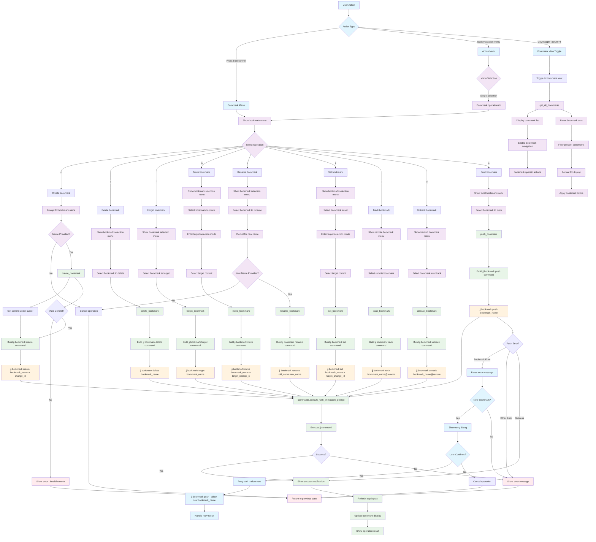

# Bookmark Operations Workflow

## Key Menu Options

- **c**: Create bookmark at current commit
- **d**: Delete existing bookmark
- **f**: Forget bookmark (remove without propagating deletion)
- **m**: Move bookmark to different commit
- **r**: Rename bookmark
- **s**: Set bookmark to point to specific commit
- **t**: Track remote bookmark
- **u**: Untrack remote bookmark
- **p**: Push bookmark to remote

## Command Variations

- **Create**: `jj bookmark create <name> -r <change_id>`
- **Delete**: `jj bookmark delete <name>`
- **Forget**: `jj bookmark forget <name>`
- **Move**: `jj bookmark move <name> -r <target_change_id>`
- **Rename**: `jj bookmark rename <old_name> <new_name>`
- **Set**: `jj bookmark set <name> -r <target_change_id>`
- **Track**: `jj bookmark track <name@remote>`
- **Untrack**: `jj bookmark untrack <name@remote>`
- **Push**: `jj bookmark push <name>`

## Advanced Features

- **Bookmark View**: Toggle between commit log and bookmark list views
- **Smart Push**: Automatic retry with `--allow-new` for new bookmarks
- **Filtering**: Separate menus for local, remote, and tracked bookmarks
- **Visual Integration**: Bookmarks displayed with consistent colors in log view

## File Locations

- **Core**: `lua/jj-nvim/jj/bookmark_commands.lua`
- **Actions**: `lua/jj-nvim/jj/actions.lua:546-560`
- **Action Menu**: `lua/jj-nvim/ui/action_menu.lua:144-148`
- **View Toggle**: `lua/jj-nvim/ui/window.lua` (Ctrl+T/Tab)
- **Keybinding**: `b` key for bookmark menu