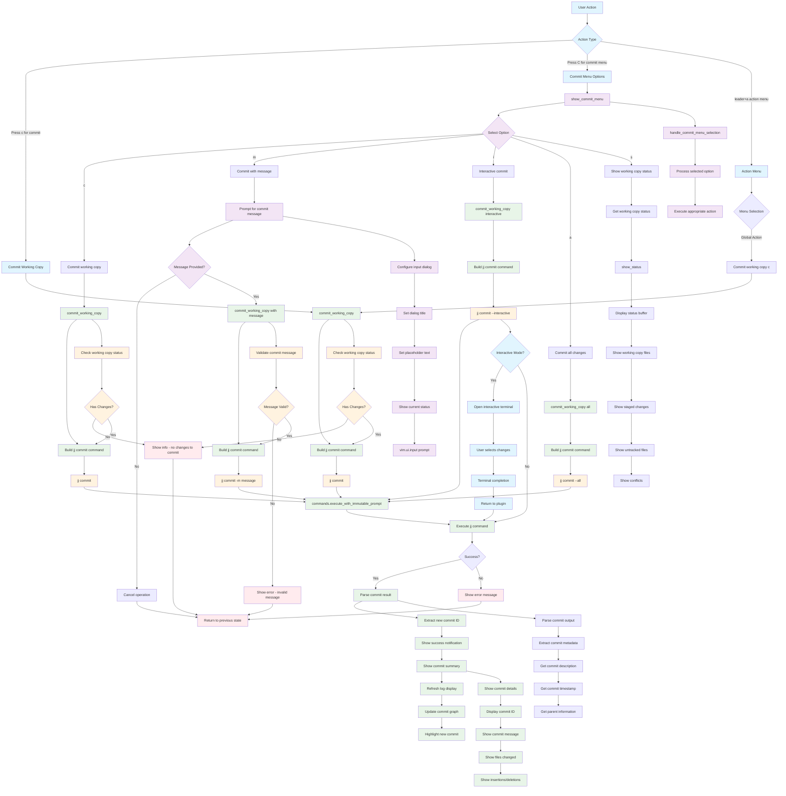

# Commit Command Workflow

## Key Menu Options

- **c**: Commit working copy (simple commit)
- **m**: Commit with message (prompt for commit message)
- **i**: Interactive commit (select changes interactively)
- **a**: Commit all changes (--all flag)
- **s**: Show working copy status before committing

## Command Variations

- **Simple**: `jj commit` - commits working copy changes
- **With Message**: `jj commit -m "message"` - commits with specified message
- **Interactive**: `jj commit --interactive` - opens interactive selection
- **All Changes**: `jj commit --all` - commits all changes including untracked

## Interactive Features

- **Message Input**: Native vim input dialog for commit messages
- **Interactive Selection**: Terminal-based file selection for staging
- **Status Preview**: Shows working copy status before committing
- **Validation**: Ensures there are changes to commit

## Commit Process

1. **Status Check**: Verifies working copy has changes
2. **Message Input**: Prompts for commit message (if needed)
3. **Validation**: Ensures message is valid
4. **Execution**: Executes appropriate jj commit command
5. **Feedback**: Shows commit result and updates display

## Success Feedback

After successful commit:
- **Commit Details**: Shows new commit ID and message
- **File Summary**: Lists changed files and statistics
- **Graph Update**: Refreshes log display with new commit
- **Highlighting**: Highlights the new commit in the log

## Working Copy Status

The status check shows:
- **Modified Files**: Files with changes
- **Staged Changes**: Changes ready for commit
- **Untracked Files**: New files not in version control
- **Conflicts**: Any merge conflicts present

## File Locations

- **Core**: `lua/jj-nvim/jj/commit.lua`
- **Actions**: `lua/jj-nvim/jj/actions.lua:568-571`
- **Action Menu**: `lua/jj-nvim/ui/action_menu.lua` (global actions)
- **Keybindings**: `c` for commit, `C` for commit menu