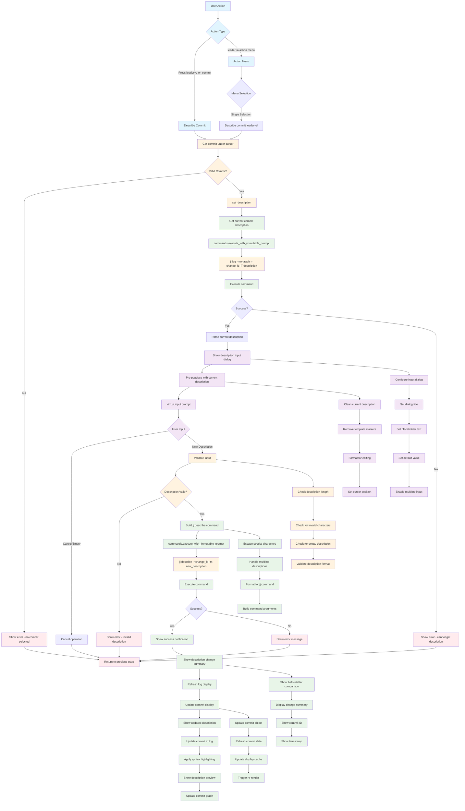

# Describe Command Workflow

## Key Features

- **Current Description**: Shows existing description for editing
- **Interactive Input**: Uses vim.ui.input for description editing
- **Validation**: Ensures description is valid before applying
- **Pre-population**: Loads current description for easy editing

## Description Input

The describe command provides:
- **Current Description**: Pre-populated with existing description
- **Interactive Dialog**: Native vim input dialog
- **Multiline Support**: Handles multiline descriptions
- **Validation**: Checks for valid description format
- **Cancellation**: Can cancel without changes

## Input Dialog Features

- **Title**: "Set commit description"
- **Placeholder**: Current description or helpful text
- **Default Value**: Current commit description
- **Multiline**: Support for detailed descriptions
- **Validation**: Real-time validation feedback

## Description Processing

- **Special Characters**: Proper escaping for shell execution
- **Multiline Handling**: Preserves line breaks and formatting
- **Template Cleaning**: Removes jj template markers
- **Format Validation**: Ensures description meets requirements

## Success Feedback

After successful description change:
- **Before/After**: Shows old vs new description
- **Change Summary**: Highlights what was modified
- **Commit Info**: Shows affected commit ID and timestamp
- **Visual Update**: Refreshes log display with new description

## File Locations

- **Core**: `lua/jj-nvim/jj/describe.lua`
- **Actions**: `lua/jj-nvim/jj/actions.lua:566-567`
- **Action Menu**: `lua/jj-nvim/ui/action_menu.lua` (context-sensitive)
- **Keybinding**: `<leader>d` for describe operation