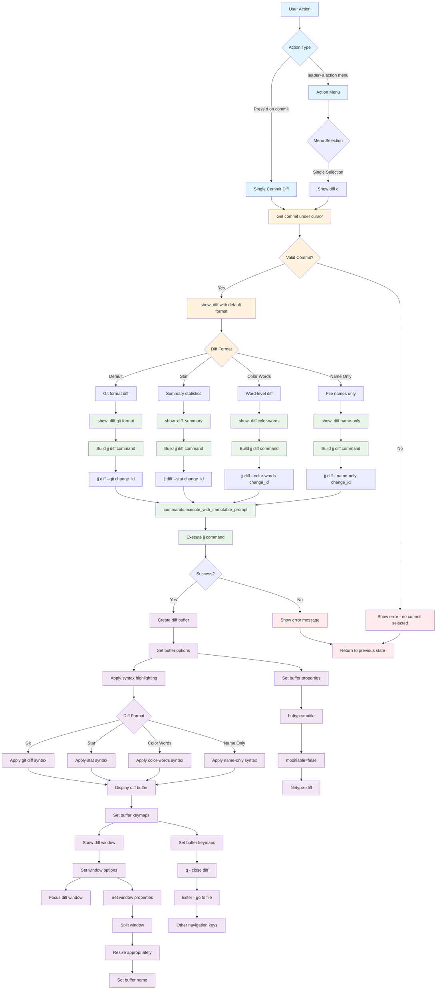

# Diff Command Workflow

## Key Features

- **Multiple Diff Formats**: Git, stat, color-words, name-only
- **Syntax Highlighting**: Format-specific highlighting in diff buffer
- **Buffer Management**: Creates dedicated diff buffer with proper configuration
- **Navigation**: Keymaps for easy navigation within diff buffer

## Diff Formats

- **Git Format**: `jj diff --git` - Standard git-style diff
- **Stat Format**: `jj diff --stat` - Summary statistics (files changed, insertions, deletions)
- **Color Words**: `jj diff --color-words` - Word-level diff highlighting
- **Name Only**: `jj diff --name-only` - Just file names that changed

## Buffer Features

- **Read-only**: Buffer is not modifiable
- **Syntax Highlighting**: Appropriate syntax for each diff format
- **Keymaps**: `q` to close, `Enter` to go to file, navigation keys
- **Window Management**: Split window with appropriate sizing

## File Locations

- **Core**: `lua/jj-nvim/jj/diff.lua`
- **Actions**: `lua/jj-nvim/jj/actions.lua:531-533`
- **Action Menu**: `lua/jj-nvim/ui/action_menu.lua:102-107`
- **Keybinding**: `d` key for diff operation