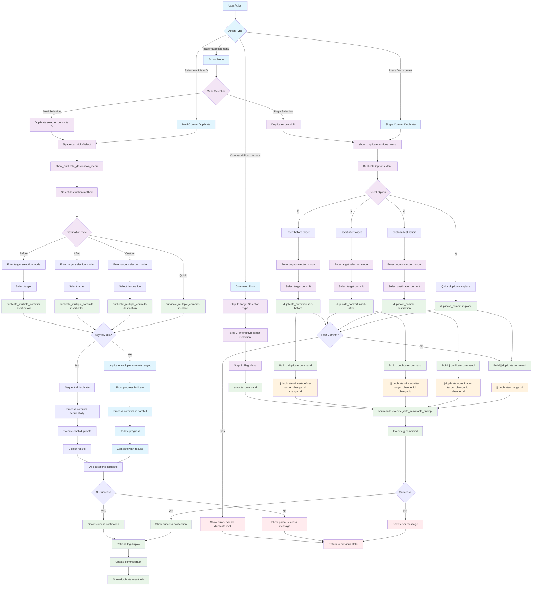

# Duplicate Command Workflow

## Key Menu Options

- **q**: Quick duplicate in-place (creates duplicate at same location)
- **d**: Custom destination (user selects where to place duplicate)
- **a**: Insert after target (place duplicate after selected target)
- **b**: Insert before target (place duplicate before selected target)

## Command Variations

- **In-place**: `jj duplicate <change_id>`
- **Destination**: `jj duplicate --destination <target_change_id> <change_id>`
- **Insert After**: `jj duplicate --insert-after <target_change_id> <change_id>`
- **Insert Before**: `jj duplicate --insert-before <target_change_id> <change_id>`
- **Multiple**: `jj duplicate <change_id1> <change_id2> ...`

## Advanced Features

- **Multi-Commit Support**: Select multiple commits with space bar
- **Async Processing**: Progress indicators for multiple duplicate operations
- **Target Selection**: Visual commit selection for destination operations
- **Batch Operations**: Duplicate multiple commits to same destination

## File Locations

- **Core**: `lua/jj-nvim/jj/duplicate.lua`
- **Actions**: `lua/jj-nvim/jj/actions.lua:524-530`
- **Command Flow**: `lua/jj-nvim/ui/command_flow.lua:279-315`
- **Action Menu**: `lua/jj-nvim/ui/action_menu.lua:134-138, 157-161`
- **Keybinding**: `D` (capital) key for duplicate operation