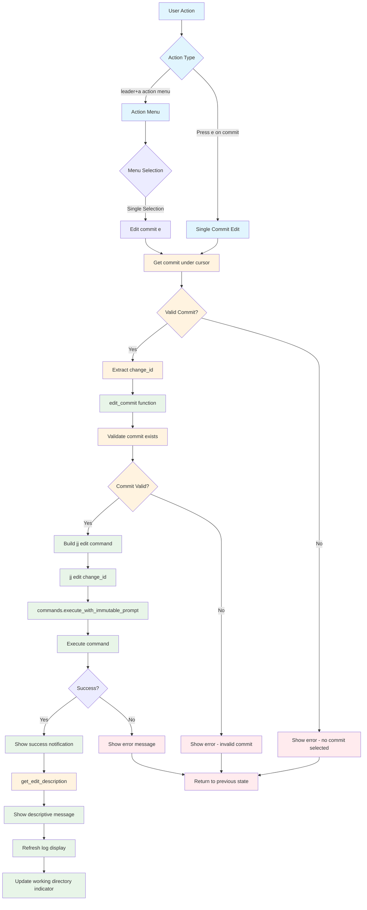

# Edit Command Workflow

## Key Features

- **Simple Operation**: Direct execution without complex menus
- **Working Directory Update**: Moves working directory to selected commit
- **Validation**: Ensures valid commit is selected
- **Descriptive Feedback**: Shows user-friendly description of edit operation

## Command Details

- **JJ Command**: `jj edit <change_id>`
- **Effect**: Changes the working directory to point to the specified commit
- **Use Case**: Switch to a different commit to make changes

## File Locations

- **Core**: `lua/jj-nvim/jj/edit.lua`
- **Actions**: `lua/jj-nvim/jj/actions.lua:507-508`
- **Action Menu**: `lua/jj-nvim/ui/action_menu.lua:108-113`
- **Keybinding**: `e` key for edit operation