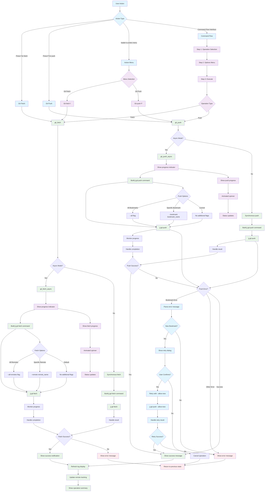

# Git Operations Workflow

## Key Features

- **Async Operations**: Non-blocking fetch and push with progress indicators
- **Smart Error Handling**: Automatic retry with `--allow-new` for bookmark errors
- **Progress Feedback**: Visual progress indicators for long operations
- **Flexible Options**: Support for all remotes, specific remotes, specific bookmarks

## Git Operations

### Fetch
- **Command**: `jj git fetch`
- **Options**: `--all-remotes`, `--remote <name>`
- **Async**: Shows progress spinner and status updates

### Push
- **Command**: `jj git push`
- **Options**: `--all`, `--bookmark <name>`, `--allow-new`
- **Smart Retry**: Automatically suggests `--allow-new` for new bookmarks

## Smart Error Handling

The push operation includes intelligent error handling:
1. **Bookmark Errors**: Detects new bookmark errors and offers to retry with `--allow-new`
2. **User Confirmation**: Shows dialog explaining the retry option
3. **Automatic Retry**: Executes retry with appropriate flags
4. **Fallback**: Returns to error state if retry fails

## File Locations

- **Core**: `lua/jj-nvim/jj/git.lua`
- **Actions**: `lua/jj-nvim/jj/actions.lua:541-545`
- **Action Menu**: `lua/jj-nvim/ui/action_menu.lua:162-171`
- **Command Flow**: `lua/jj-nvim/ui/command_flow.lua:132-167`
- **Keybindings**: `f` for fetch, `P` for push