# Log Graph Parsing and Rendering Flow

```mermaid
flowchart TD
    Start([User calls :JJToggle]) --> ShowLog[init.lua:show_log]
    ShowLog --> ParseCommits[parser.parse_commits_with_separate_graph]
    
    %% Main Parser Function
    ParseCommits --> BuildGraphArgs[Build graph command args]
    ParseCommits --> BuildTemplateArgs[Build template command args]
    
    %% Command Execution
    BuildGraphArgs --> ExecGraphCmd[commands.execute - graph structure]
    ExecGraphCmd --> GraphOutput[Graph output with ASCII structure]
    
    BuildTemplateArgs --> ExecTemplateCmd[commands.execute - template data]
    ExecTemplateCmd --> TemplateOutput[Template output with 18 fields per commit]
    
    %% Parsing Phase
    GraphOutput --> ParseGraphStructure[parser.parse_graph_structure]
    ParseGraphStructure --> GraphStateMachine[State machine processing]
    GraphStateMachine --> GraphEntries[Extract commits, connectors, elided sections]
    
    TemplateOutput --> ParseTemplateData[parser.parse_template_data]
    ParseTemplateData --> SplitRecords[Split by record separator 0x1E]
    SplitRecords --> ExtractFields[Extract 18 fields per commit]
    ExtractFields --> CommitDataMap[Index commits by ID]
    
    %% Data Merging
    GraphEntries --> MergeData[parser.merge_graph_and_template_data]
    CommitDataMap --> MergeData
    MergeData --> CreateCommitObjects[commit.from_template_data for each entry]
    CreateCommitObjects --> AddGraphStructure[Add graph components to commits]
    AddGraphStructure --> FindSymbols[find_rightmost_symbol - extract @ ○ ◆ ×]
    FindSymbols --> MixedEntries[List of commits, elided, connectors]
    
    %% Buffer Creation
    MixedEntries --> CreateBuffer[buffer.create_from_commits]
    CreateBuffer --> UpdateBuffer[buffer.update_from_commits]
    
    %% Rendering Pipeline
    UpdateBuffer --> RenderWithHighlights[renderer.render_with_highlights]
    RenderWithHighlights --> RenderCommits[renderer.render_commits]
    
    RenderCommits --> EntryLoop[Process each entry by type]
    EntryLoop --> RenderCommit{Entry Type}
    
    RenderCommit -->|commit| ProcessCommit[render_commit]
    RenderCommit -->|elided| ProcessElided[render_elided_section]
    RenderCommit -->|connector| ProcessConnector[Add connector lines]
    
    %% Commit Rendering Detail
    ProcessCommit --> GetMainLineParts[commit.get_main_line_parts]
    GetMainLineParts --> CreateCommitParts[Create graph, author, timestamp, etc parts]
    CreateCommitParts --> WrapText[wrap_text_by_words - intelligent wrapping]
    WrapText --> GetContinuationGraph[get_continuation_graph_from_commit]
    GetContinuationGraph --> ApplyColors[apply_symbol_colors]
    
    %% Finalization
    ProcessElided --> CombineLines[Combine all rendered lines]
    ProcessConnector --> CombineLines
    ApplyColors --> CombineLines
    
    CombineLines --> CreateHighlights[Generate ANSI highlight groups]
    CreateHighlights --> UpdateBufferContent[Set buffer lines and highlights]
    UpdateBufferContent --> Complete([Log display complete])
    
    %% Styling
    classDef entry fill:#e1f5fe
    classDef parser fill:#f3e5f5
    classDef command fill:#fff3e0
    classDef render fill:#e8f5e8
    classDef success fill:#e8f5e8
    
    class Start,ShowLog entry
    class ParseCommits,ParseGraphStructure,ParseTemplateData,MergeData,CreateCommitObjects parser
    class ExecGraphCmd,ExecTemplateCmd command
    class RenderWithHighlights,RenderCommits,ProcessCommit,GetMainLineParts,WrapText,ApplyColors render
    class Complete success
```

## Key Function Flow

### Entry Point
- `init.lua:show_log()` - Main entry point
- `parser.parse_commits_with_separate_graph()` - Core parsing function

### Command Execution
- `commands.execute()` - Executes jj commands with timeout handling
- Two commands run: graph structure and template data extraction

### Graph Structure Parsing
- `parser.parse_graph_structure()` - State machine parsing of ASCII graph
- Extracts commits, connectors, and elided sections
- Preserves graph visual structure

### Template Data Parsing  
- `parser.parse_template_data()` - Structured field extraction
- Splits records by separator (0x1E) and fields by separator (0x1F)
- Creates lookup map of commit metadata

### Data Merging
- `parser.merge_graph_and_template_data()` - Combines graph and template data
- `commit.from_template_data()` - Creates commit objects
- `find_rightmost_symbol()` - Extracts graph components (prefix, symbol, suffix)

### Rendering Pipeline
- `renderer.render_commits()` - Main rendering loop
- `render_commit()` - Individual commit rendering with wrapping
- `commit.get_main_line_parts()` - Creates structured display parts
- `wrap_text_by_words()` - Intelligent text wrapping preserving graph
- `get_continuation_graph_from_commit()` - Graph continuation for wrapped lines
- `apply_symbol_colors()` - Symbol-specific ANSI coloring

### Buffer Operations
- `buffer.create_from_commits()` - Buffer creation
- `vim.api.nvim_buf_set_lines()` - Content update
- `vim.api.nvim_buf_add_highlight()` - Highlighting application

## Key Data Structures

- **Graph Entries**: Commits, connectors, elided sections with positioning
- **Template Data**: 18 fields per commit (ID, author, description, etc.)
- **Commit Objects**: Merged graph + template data with display methods
- **CommitParts**: Typed display components (graph, author, timestamp, etc.)

## File Locations

- **Parser**: `lua/jj-nvim/core/parser.lua`
- **Renderer**: `lua/jj-nvim/core/renderer.lua`
- **Commands**: `lua/jj-nvim/jj/commands.lua`
- **Buffer**: `lua/jj-nvim/ui/buffer.lua`
- **Commit**: `lua/jj-nvim/core/commit.lua`