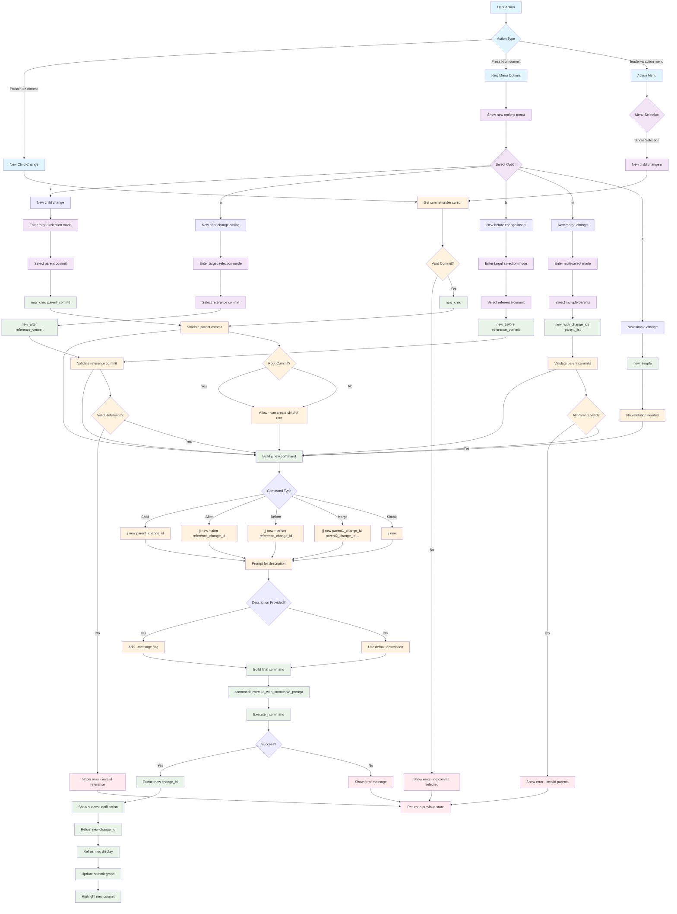

# New Command Workflow

## Key Menu Options

- **c**: New child change (creates child of selected commit)
- **a**: New after change (creates sibling after selected commit)
- **b**: New before change (inserts before selected commit)
- **m**: New merge change (creates merge commit with multiple parents)
- **s**: New simple change (creates new change without parent specification)

## Command Variations

- **Child**: `jj new <parent_change_id>`
- **After**: `jj new --after <reference_change_id>`
- **Before**: `jj new --before <reference_change_id>`
- **Merge**: `jj new <parent1_change_id> <parent2_change_id> ...`
- **Simple**: `jj new`
- **With Message**: Any of the above with `--message "description"`

## Advanced Features

- **Multi-Parent Support**: Select multiple parents for merge commits
- **Optional Descriptions**: Prompt for commit message
- **Change ID Return**: Returns new change ID for further operations
- **Graph Updates**: Automatically refreshes and highlights new commit

## File Locations

- **Core**: `lua/jj-nvim/jj/new.lua`
- **Actions**: `lua/jj-nvim/jj/actions.lua:534-540`
- **Action Menu**: `lua/jj-nvim/ui/action_menu.lua:139-143`
- **Keybindings**: `n` for new child, `N` for new menu