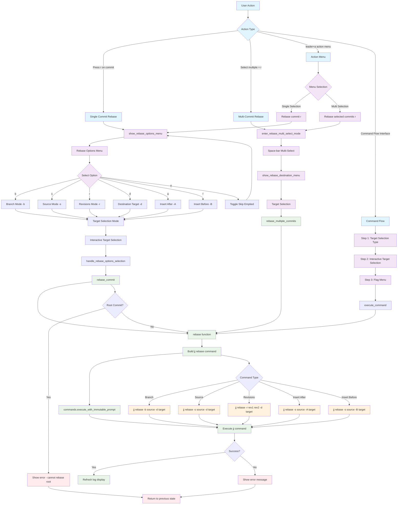

# Rebase Command Workflow

## Key Menu Options

- **b**: Branch mode (`-b`) - rebase entire branch
- **s**: Source mode (`-s`) - rebase commit and descendants  
- **r**: Revisions mode (`-r`) - rebase specific commits
- **d**: Destination target (`-d`) - standard rebase destination
- **a**: Insert after (`-A`) - insert commits after target
- **f**: Insert before (`-B`) - insert commits before target
- **e**: Toggle skip emptied commits flag

## File Locations

- **Core**: `lua/jj-nvim/jj/rebase.lua`
- **Actions**: `lua/jj-nvim/jj/actions.lua:491-501`
- **Command Flow**: `lua/jj-nvim/ui/command_flow.lua:168-204`
- **Action Menu**: `lua/jj-nvim/ui/action_menu.lua:114-118, 147-151`