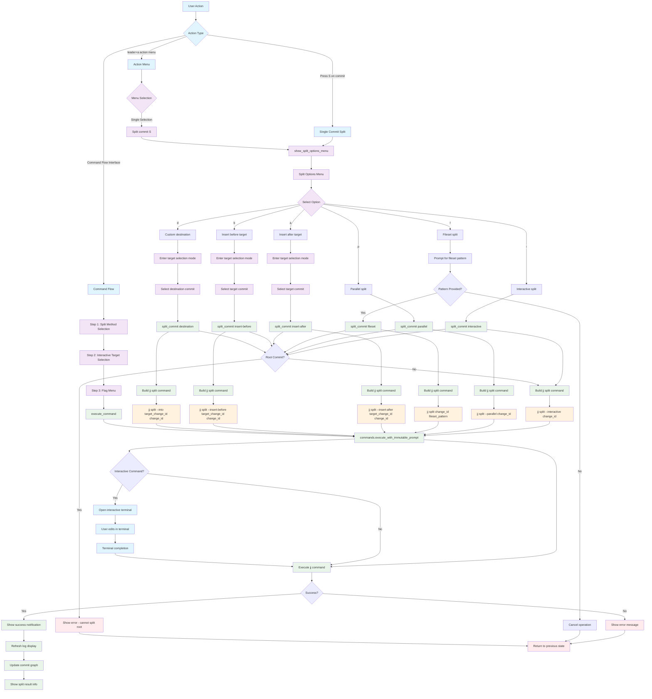

# Split Command Workflow

## Key Menu Options

- **i**: Interactive split (default) - opens editor to select files
- **p**: Parallel split - creates parallel commits instead of sequential
- **f**: Fileset split - split based on file pattern
- **a**: Insert after target - split and insert result after target commit
- **b**: Insert before target - split and insert result before target commit
- **d**: Custom destination - split and move to specific destination

## Command Variations

- **Interactive**: `jj split --interactive <change_id>`
- **Parallel**: `jj split --parallel <change_id>`
- **Fileset**: `jj split <change_id> <fileset_pattern>`
- **Insert After**: `jj split --insert-after <target_change_id> <change_id>`
- **Insert Before**: `jj split --insert-before <target_change_id> <change_id>`
- **Destination**: `jj split --into <target_change_id> <change_id>`

## Interactive Features

- **Terminal Integration**: Interactive splits open in terminal for file selection
- **Fileset Patterns**: Support for jj fileset syntax for advanced file selection
- **Target Selection**: Visual commit selection for destination operations

## File Locations

- **Core**: `lua/jj-nvim/jj/split.lua`
- **Actions**: `lua/jj-nvim/jj/actions.lua:517-523`
- **Command Flow**: `lua/jj-nvim/ui/command_flow.lua:242-278`
- **Action Menu**: `lua/jj-nvim/ui/action_menu.lua:129-133`
- **Keybinding**: `S` (capital) key for split operation