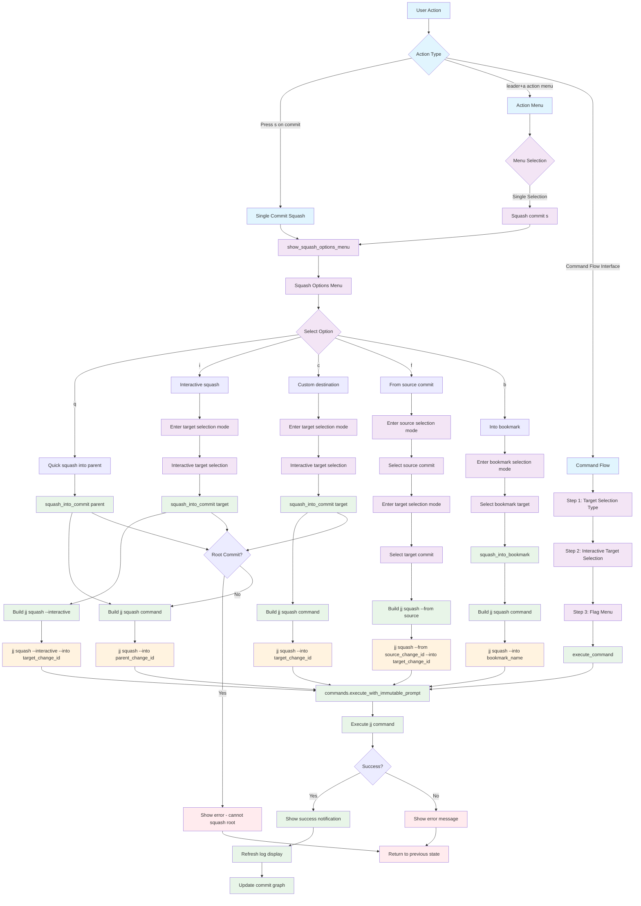

# Squash Command Workflow

## Key Menu Options

- **q**: Quick squash into parent (no interaction needed)
- **i**: Interactive squash (user selects files to squash)
- **c**: Custom destination (user selects target commit)
- **f**: From source commit (user selects both source and target)
- **b**: Into bookmark (user selects bookmark target)

## Command Variations

- **Standard**: `jj squash --into <target_change_id>`
- **Interactive**: `jj squash --interactive --into <target_change_id>`
- **From Source**: `jj squash --from <source_change_id> --into <target_change_id>`
- **Into Bookmark**: `jj squash --into <bookmark_name>`

## File Locations

- **Core**: `lua/jj-nvim/jj/squash.lua`
- **Actions**: `lua/jj-nvim/jj/actions.lua:509-516`
- **Command Flow**: `lua/jj-nvim/ui/command_flow.lua:205-241`
- **Action Menu**: `lua/jj-nvim/ui/action_menu.lua:124-128`
- **Keybinding**: `s` key for squash operation