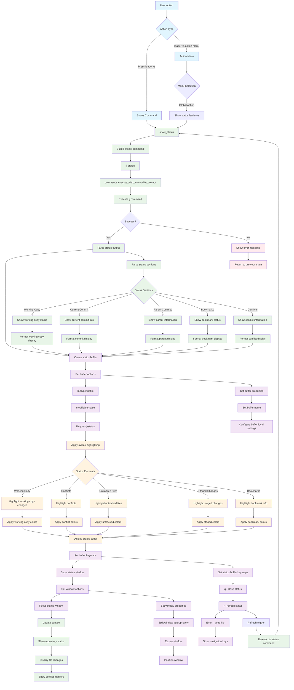

# Status Command Workflow

## Key Features

- **Repository Status**: Shows current working copy state
- **Syntax Highlighting**: Color-coded status elements
- **Interactive Buffer**: Keymaps for navigation and refresh
- **Comprehensive Info**: Working copy, commits, bookmarks, conflicts

## Status Information

The status command displays:
- **Working Copy**: Current changes and state
- **Current Commit**: Active commit information
- **Parent Commits**: Commit hierarchy
- **Bookmarks**: Local and remote bookmark status
- **Conflicts**: Any merge conflicts present
- **Untracked Files**: Files not in version control

## Buffer Features

- **Read-only**: Status buffer is not modifiable
- **Syntax Highlighting**: Appropriate colors for each status element
- **Keymaps**: 
  - `q` - close status buffer
  - `r` - refresh status
  - `Enter` - go to file under cursor
  - Navigation keys for movement
- **Auto-refresh**: Can be refreshed without reopening

## Status Elements Highlighting

- **Working Copy Changes**: Modified files and their status
- **Conflicts**: Merge conflicts with special highlighting
- **Untracked Files**: Files not tracked by jj
- **Staged Changes**: Changes ready for commit
- **Bookmarks**: Local and remote bookmark information

## File Locations

- **Core**: `lua/jj-nvim/jj/status.lua`
- **Actions**: `lua/jj-nvim/jj/actions.lua:561-562`
- **Action Menu**: `lua/jj-nvim/ui/action_menu.lua:172-176`
- **Keybinding**: `<leader>s` for status command