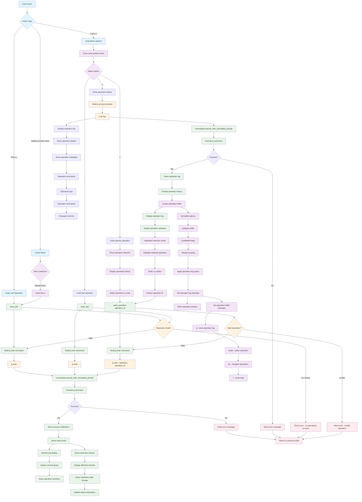

# Undo Command Workflow

## Key Menu Options

- **l**: Undo last operation (same as simple `u`)
- **o**: Undo specific operation (interactive selection)
- **s**: Show operation history (browse without undoing)

## Command Variations

- **Last**: `jj undo` - undoes the most recent operation
- **Specific**: `jj undo --operation <operation_id>` - undoes specific operation
- **History**: `jj op log` - shows operation history for browsing

## Advanced Features

- **Operation History**: Interactive browsing of all operations
- **Selective Undo**: Undo any operation from history, not just the last
- **Operation Details**: Shows timestamps, types, and affected commits
- **Safe Validation**: Prevents invalid undo operations

## Operation Log Features

- **Interactive Buffer**: Browse operations with syntax highlighting
- **Operation Metadata**: Timestamps, types, descriptions
- **Commit Tracking**: Shows which commits were affected
- **Selection Mode**: Choose specific operations to undo

## Safety Features

- **Validation**: Ensures operations exist and are valid to undo
- **Confirmation**: Shows what will be undone before executing
- **Error Handling**: Clear messages for invalid operations
- **State Checking**: Verifies repository state before undo

## File Locations

- **Core**: `lua/jj-nvim/jj/undo.lua`
- **Actions**: `lua/jj-nvim/jj/actions.lua:563-565`
- **Action Menu**: `lua/jj-nvim/ui/action_menu.lua:177-181`
- **Keybindings**: `u` for undo last, `U` for undo menu